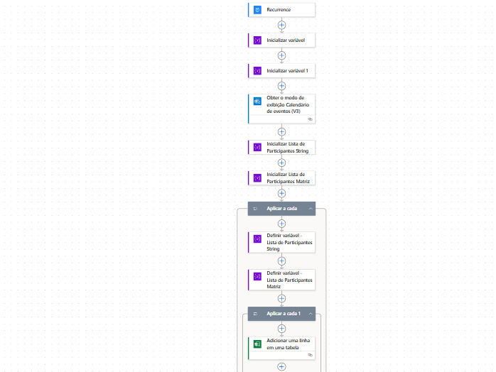
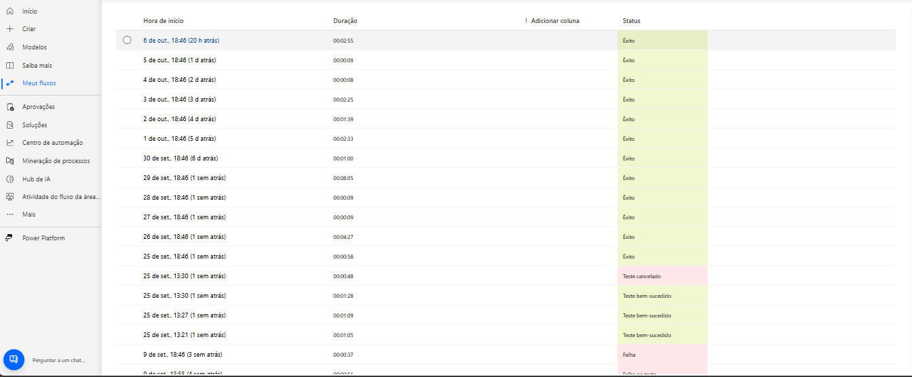
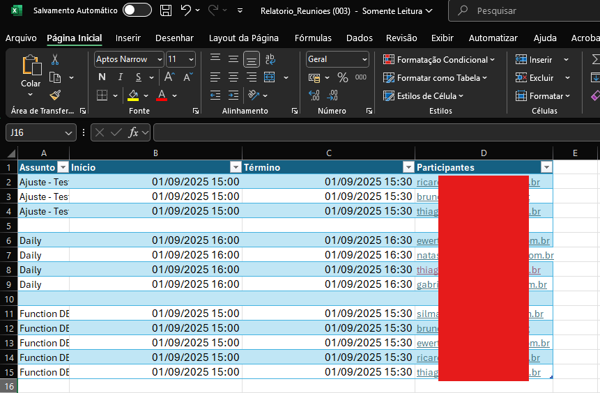

# Fluxo: Consulta de Reuniões e Exportação para Excel (Power Automate)
## Fluxo: Consulta de Reuniões e Exportação para Excel (Power Automate)
### Visão Geral

Fluxo agendado criado no **Power Automate** que é executado **diariamente às 18:00 (BRT)**.  
O fluxo consulta o **calendário do Outlook** de um usuário, obtém todas as **reuniões do dia** (janela entre 06:00 e 22:00) e registra as informações em uma **planilha Excel** no OneDrive for Business. Cada participante é inserido em **uma linha separada** — se uma reunião tiver 6 participantes, o fluxo criará 6 linhas com os mesmos valores de **Assunto, Início e Término**, variando apenas o campo **Participante**.

Esse documento descreve a solução, o gatilho, variáveis, ações, expressões e considerações práticas para inclusão no seu repositório do GitHub.

A planilha Excel é composta por colunas como: **Assunto (reunião), Início, Término e Participante**.  

Ou seja, se havia 6 participantes em uma reunião, será inserido **um participante por linha**, repetindo as informações de **Assunto, Início e Término**.  

---

## Solução Criada

**Recorrência (Recurrence)**
- Intervalo: 1  
- Frequência: Dia  
- Fuso Horário: UTC -03h00 (Brasília)  
- Horário de disparo: 18:00  

**1ª Variável – Inicializar variável**  
- Nome: `InicioJanela`  
- Tipo: Cadeia de Caracteres  
- Valor:  
```text
formatDateTime(addHours(startOfDay(utcNow()), 6), 'yyyy-MM-ddTHH:mm:ssZ')
```

**2ª Variável – Inicializar variável**  
- Nome: `FimJanela`  
- Tipo: Cadeia de Caracteres  
- Valor:  
```text
formatDateTime(addHours(startOfDay(utcNow()), 22), 'yyyy-MM-ddTHH:mm:ssZ')
```

**Novo Step – Obter o modo de exibição Calendário de eventos (V3)**  
- ID do calendário: `Calendar`  
- Hora de Início: `@{variables('InicioJanela')}`  
- Hora de Término: `@{variables('FimJanela')}`

**3ª Variável – Inicializar variável**  
- Nome: `ListaParticipantesString`  
- Tipo: Cadeia de Caracteres  
- Valor: *(vazio)*

**4ª Variável – Inicializar variável**  
- Nome: `ListaParticipantes`  
- Tipo: Matriz  
- Valor: *(vazio)*

---

**Novo Step – Aplicar a cada**  
- Selecionar saída das etapas anteriores:  
```text
@{outputs('Obter_o_modo_de_exibição_Calendário_de_eventos_(V3)')?['body/value']}
```

Dentro do "Aplicar a cada":  

**Definir variável – ListaParticipanteString**  
```text
concat(items('Aplicar_a_cada')?['requiredAttendees'], items('Aplicar_a_cada')?['optionalAttendees'])
```

**Definir variável – ListaParticipantes**  
```text
split(variables('ListaParticipantesString'), ';')
```

Dentro do aplicar a cada, **inserir um novo "Aplicar a cada 2"** (apply_to_each2) e dentro dele:

**Ação – Adicionar uma linha em uma tabela (Excel Online Business)**  
- Localização: OneDrive for Business  
- Biblioteca de Documentos: Documentos  
- Arquivo: `/pasta/selecionarsuaplanilha.xlsx`  
- Tabela: `Tabela1` *(verificar se é a tabela correta caso haja mais de uma)*  

**Parâmetros avançados:**  
- Assunto: `@{items('Aplicar_a_cada')?['subject']}`  
- Início:  
```text
formatDateTime(convertTimeZone(items('Aplicar_a_cada')?['Start'],'UTC','E. South America Standard Time'),'yyyy/MM/dd HH:mm:ss')
```  
- Término:  
```text
formatDateTime(convertTimeZone(items('Aplicar_a_cada')?['end'],'UTC','E. South America Standard Time'),'yyyy/MM/dd HH:mm:ss')
```  
- Participantes: `@{items('Aplicar_a_cada_2')}`

---

O fluxo foi criado com sucesso e **as informações são capturadas para a planilha diariamente às 18h00 (BRT)**.  

Também é possível estender o fluxo para **enviar a planilha por e-mail**, juntamente com o anexo.

**Passos adicionais para envio de e-mail:**

1. **Obter conteúdo de arquivo – OneDrive for Business**  
- Arquivo: `/pasta/selecionarsuaplanilha.xlsx`  
- Inferir Tipo de Conteúdo: Sim

2. **Enviar um e-mail (V2) – Office 365 Outlook**  
- Para: seu usuário (e-mail)  
- Assunto: `Relatório de Reuniões`  
- Corpo: `Segue em anexo relatório de reuniões.`  

**Anexo:**  
```json
[
  {
    "Name": "suaplanilha.xlsx",
    "ContentBytes": "<conteúdo do arquivo>"
  }
]
```

---

## Resultado esperado

- Execução diária às 18:00 (BRT).  
- Coleta de todas as reuniões entre 06:00 e 22:00 do dia.  
- Inserção dos dados no Excel (cada reunião e lista de participantes conforme mapeamento).  
- (Opcional) Envio automático da planilha por e‑mail.

---

## Observações, melhorias e boas práticas

- **Tabela no Excel:** verifique que a planilha esteja formatada como **Tabela** (Insert → Table). O passo “Adicionar linha em tabela” exige que exista uma tabela nomeada.  
- **Duplicidade:** se o fluxo for executado mais de uma vez por dia, implemente checagem para evitar inserir linhas duplicadas (ex.: comparar assunto + início + participante).  
- **Fuso horário:** usar `convertTimeZone` para normalizar horários; o exemplo usa `E. South America Standard Time`. Ajuste se necessário.  
- **Tratamento de erros:** adicione blocos de tratamento (Configure run after / Try/Catch pattern) para capturar falhas no acesso ao OneDrive ou Outlook.  
- **Auditoria:** considere gravar em outra tabela/arquivo um log de execução (data/hora e número de registros inseridos).  
---

# Links úteis (para inclusão no repositório)
## Imagem do fluxo 


## Imagem de execuções realizadas


##Imagem da planilha 


