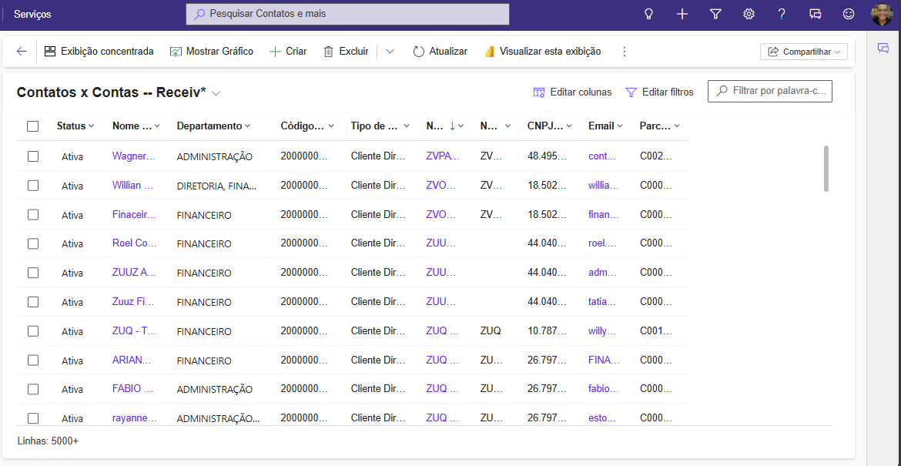
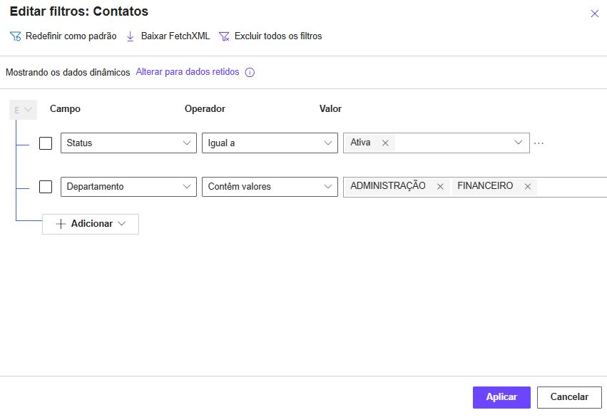

# 02 - View de Contatos Relacionados

## Objetivo
Criar um relatório (view) na entidade **Contato** para exibir todas as informações relevantes da **Conta relacionada**, permitindo que os times (comercial, financeiro, fiscal etc.) tenham acesso a todos os contatos vinculados e consigam contatar cada pessoa de forma eficiente.

## Caso Real Realizado

1. **Criação da view na entidade Contato**  
   - Ao invés de criar o relatório na entidade **Conta**, que nativamente só permite visualizar **um contato por conta**, criamos a view na **entidade Contato**.  
   - Isso permitiu **trazer todos os contatos de cada conta**, mantendo a referência à conta à qual pertencem.

2. **Campos exibidos na view**  
   - Nome do contato  
   - Sobrenome  
   - E-mail  
   - Departamento  
   - Nome da conta relacionada  

3. **Filtros e ordenação**  
   - Apenas contatos **ativos** foram exibidos.  
   - Ordenação por **sobrenome** para facilitar a busca.  
   - Configuração de filtros adicionais, como **tipo de conta** ou **unidade de negócio**, se necessário.

4. **Benefícios entregues**  
   - Permite que **todos os contatos de uma conta** sejam visualizados e acessados rapidamente.  
   - Facilita o trabalho de **comercial, financeiro, fiscal** e outros times que precisam contatar pessoas específicas.  
   - Melhora a **organização e eficiência** no atendimento e gestão de clientes.

## Ferramentas Utilizadas
- Dynamics 365 Customer Service / Sales  
- Dataverse (estrutura de dados da Conta e Contato)  
- XrmToolBox (opcional, para verificações e ajustes)

## Aprendizados-Chave
- Como criar **views na entidade Contato** para exibir informações da Conta relacionada.  
- Como contornar limitações nativas do Dynamics 365 para atender a casos reais de negócio.  
- Aplicação prática de **relacionamentos entre entidades** para criar relatórios úteis para múltiplos times.

## Visual do Relatório

## Filtros Aplicados

