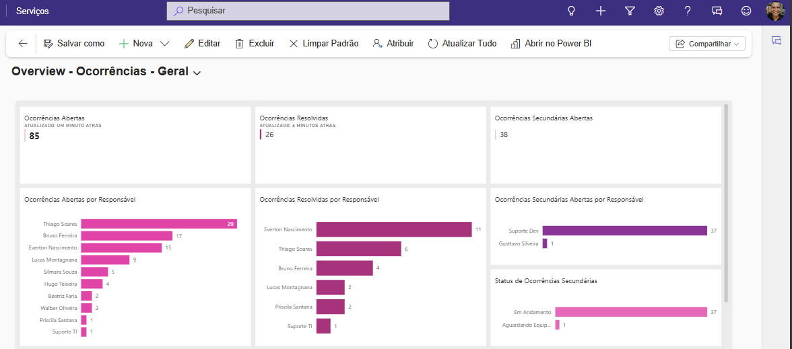
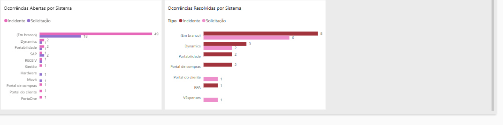
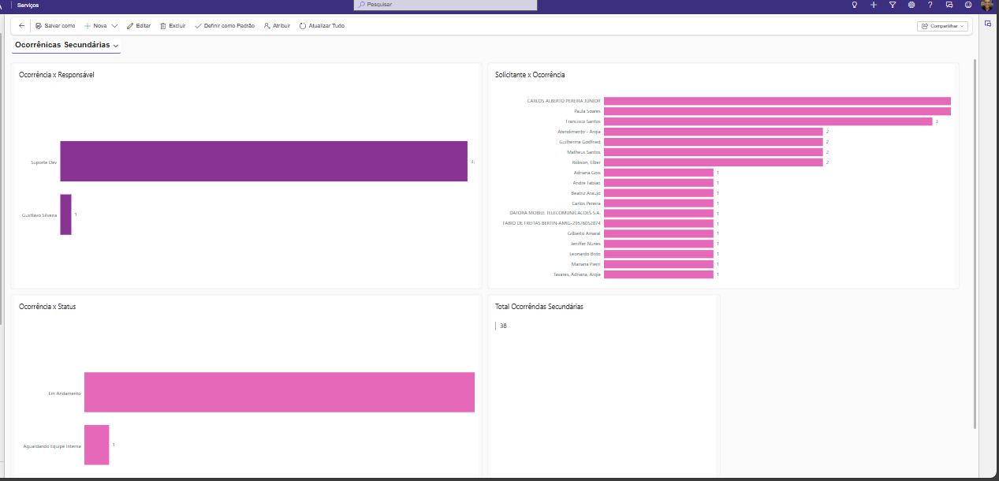
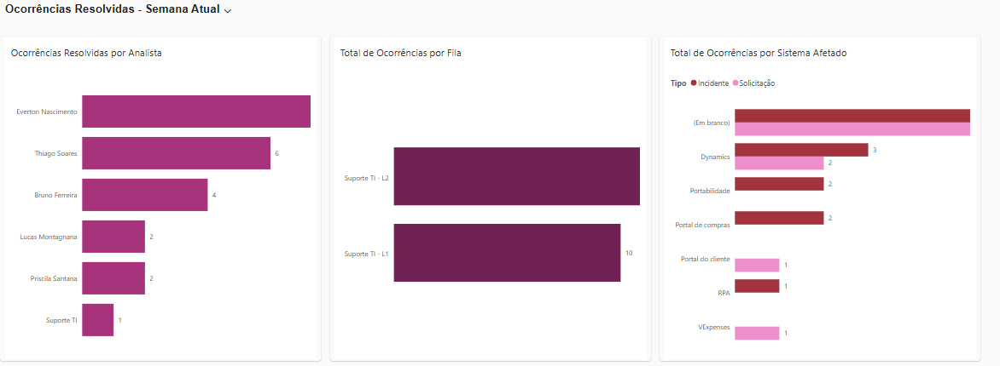
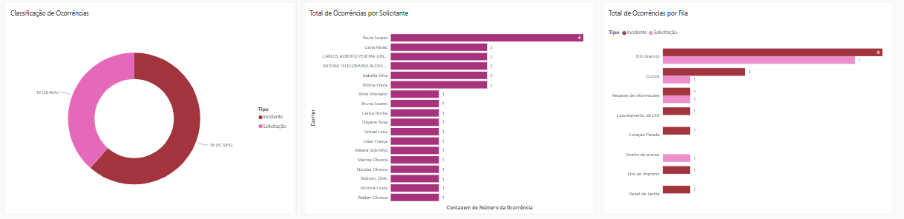
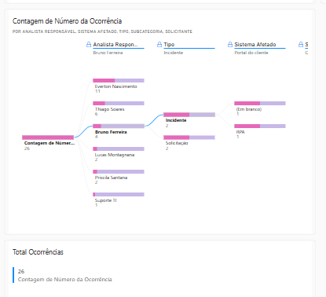

# 03 - Dashboard de Chamados

## Objetivo
Criar um **dashboard no Dynamics 365 Customer Service** para monitorar e analisar os chamados e solicitações da equipe de suporte, permitindo visualização clara de **incidentes, solicitações e ocorrências secundárias**, todos incorporados em painéis interativos no Customer Service.

## Caso Real Realizado

1. **Visualização de totais e status de chamados**  
   - Dashboard exibindo:  
     - Total de **incidentes e solicitações abertas**  
     - Total de **incidentes e solicitações resolvidas**  
     - Chamados como **ocorrências secundárias**  

2. **Chamados por responsável e fila**  
   - Ocorrências abertas por responsável na fila **Suporte TI**  
   - Ocorrências resolvidas por responsável  

3. **Análise por sistema e tipo de ocorrência**  
   - Tipos de ocorrências por **sistema afetado**  
   - Ocorrências resolvidas por **sistema**  

4. **Outros indicadores**  
   - Ocorrências por **status**  
   - Ocorrências por **solicitante**  
   - Ocorrências secundárias por **responsável**  
   - Ocorrências secundárias por **solicitante**  

5. **Benefícios entregues**  
   - Visão completa e detalhada do **volume de chamados e solicitações**  
   - Facilidade para identificar **responsáveis, sistemas afetados e padrões de ocorrência**  
   - **Painéis interativos** incorporados no Customer Service, facilitando a análise e tomada de decisão  

## Ferramentas Utilizadas
- Dynamics 365 Customer Service (dashboards e painéis nativos)  
- Dataverse (estrutura de dados de ocorrências e solicitações)  

## Aprendizados-Chave
- Criação de **dashboards detalhados e funcionais** dentro do Customer Service  
- Visualização e análise de **chamados e ocorrências secundárias**  
- Aplicação prática de filtros por **responsável, sistema, solicitante e status**

## Visuais Power BI incorporados ao app de negócio Customer Service

### Ocorrências Primárias

### Ocorrências Sencudárias

### Ocorrências Resolvidas

