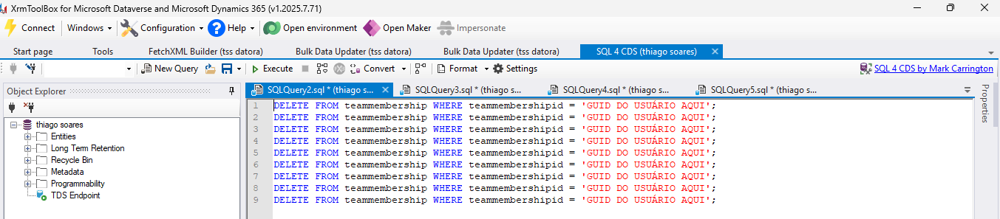
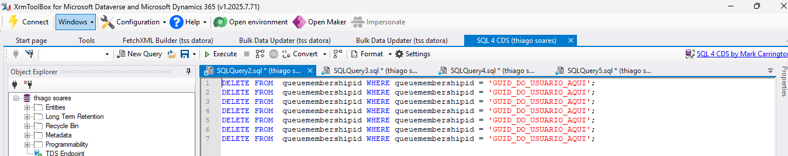

# Identificando Usuários Desativados em Filas no Dynamics 365 Customer Service

No **Dynamics 365 Customer Service**, percebi que havia muitos **usuários desativados** associados a filas. Para manter o sistema organizado, é importante fazer a **grande limpeza**!

Neste post, vou mostrar a forma prática de identificar esses usuários usando **FetchXML no XrmToolBox**.

---

##  Passo 1: Preparar o FetchXML

Use o seguinte FetchXML para identificar usuários desativados e as filas em que ainda estão associados:

```sql
<fetch>
  <entity name="queuemembership">
    <attribute name="queuemembershipid" />
    <attribute name="queueid" />
    <attribute name="systemuserid" />

    <link-entity name="systemuser" from="systemuserid" to="systemuserid" alias="usr">
      <attribute name="fullname" alias="usr_fullname"/>
      <attribute name="domainname" alias="usr_domainname"/>
      <attribute name="isdisabled" alias="usr_isdisabled"/>
      <filter>
        <condition attribute="isdisabled" operator="eq" value="1" />
      </filter>
    </link-entity>

    <link-entity name="queue" from="queueid" to="queueid" alias="q">
      <attribute name="name" alias="queue_name"/>
    </link-entity>
  </entity>
</fetch>
```

## Passo 2: O que essa Fetch retorna

- **Usuários desativados** (`isdisabled = 1`)  
- **Filas** em que eles ainda estão associados  
- **Nome completo**, **login** do usuário e o **GUID** (`systemuserid`)

---

## Passo 3: Executar no XrmToolBox

1. Abra o **XrmToolBox**.  
2. Abra o **FetchXML Builder**.  
3. Cole o FetchXML na janela de consulta.  
4. Clique em **Execute** ou **Run** para listar os registros.  
5. Verifique se os registros retornados estão corretos e exporte os dados para excel, se possível encaminhe no botão SEND para Data Bulk Updater,por lá você conseguirá visualizar todas as informações tabeladas e realizar o contro C + V numa planilha excel.

### Visual do Relatório


---

## Passo 4: Gerando Comandos SQL para Limpeza de Usuários Desativados

Você lembra da **planilha exportada no Bulk Data Updater**, com todos os dados de usuários?  
Então — é nela que vamos trabalhar agora! Nosso objetivo é gerar os **comandos SQL prontos** para exclusão de usuários desativados das tabelas **team membership** e **queue membership** no **SQL 4 CDS**.

---

### O que você vai precisar

- Planilha exportada com os **GUIDs dos usuários** (`systemuserid`)  
- Acesso ao **SQL 4 CDS** (no XrmToolBox)  
- Um pouco de **Excel** ou **Google Sheets** para montar as colunas de forma prática  

---

###  Estrutura da planilha

Crie uma nova aba (sheet) com as seguintes colunas:

| Coluna | Conteúdo | Descrição |
|:-------|:----------|:-----------|
| **A** | GUID do usuário (`systemuserid`) | Obtido da FetchXML ou outra consulta |
| **B** | `DELETE FROM teammembership WHERE teammembershipid = '` | Base do comando SQL |
| **C** | `';` | Fechamento do comando |
| **D** | Fórmula para concatenar A + B + C | Gera o comando completo |

---

###  Exemplo de concatenação

No Excel ou Sheets, use uma fórmula semelhante a esta:

```excel
=B2 & A2 & C2
```
Isso resultará em comandos completos como:

```sql
DELETE FROM teammembership WHERE teammembershipid = 'GUID_DO_USUARIO1';
```

E também para a tabela de filas:

```sql
DELETE FROM queuemembership WHERE queuemembershipid = 'GUID_DO_USUARIO1';
```

### Visual da planilha


##  Passo 5: Limpeza na Entidade de Membros de Equipe (TeamMembership)

###  Entendendo a Entidade TeamMembership

A entidade **TeamMembership** é responsável por armazenar a associação entre usuários e equipes no Dynamics 365. Cada registro representa um usuário que pertence a uma equipe específica.

###  Processo de Limpeza no SQL 4 CDS

### ** 1º: Preparação do Comando**

```sql
DELETE FROM teammembership WHERE teammembershipid = 'GUID_DO_USUARIO_AQUI';
```

### **2º: Execução no SQL 4 CDS**

a. **Abra o SQL 4 CDS**
   - Conecte-se ao ambiente desejado (HMLG ou PROD)
   - Certifique-se de estar no banco de dados correto

b. **Cole o Comando DELETE**
   ```sql
   DELETE FROM teammembership WHERE teammembershipid = 'GUID_DO_USUARIO_AQUI';
   ```

c. **Substitua o GUID**
   - Substitua `'GUID_DO_USUARIO_AQUI'` pelo GUID real do usuário que precisa ser removido
   - **Exemplo:**
   ```sql
   DELETE FROM teammembership WHERE teammembershipid = 'a1b2c3d4-e5f6-7890-abcd-ef1234567890';
   ```

### **3º: Execução do Comando**

d. **Execute o Comando**
   - Clique no botão "Execute" ou pressione `F5`
   - Aguarde a confirmação de execução

e. **Verificação de Resultado**
   - O sistema retornará uma mensagem indicando o número de registros afetados
   - **Exemplo:** `"1 row affected"`

### **4º: Confirmação da Limpeza**

f. **Valide a Exclusão**
   - Execute uma consulta para verificar se o registro foi removido:
   ```sql
   SELECT * FROM teammembership WHERE teammembershipid = 'GUID_DO_USUARIO_AQUI';
   ```

## Passo 6: Limpeza na Entidade de Membros de Filas (QueueMembership)

### Comando para Exclusão

```sql
DELETE FROM queuemembership WHERE queuemembershipid = 'GUID_DO_USUARIO_AQUI';
```

###  Processo de Execução

**Siga exatamente o mesmo passo a passo utilizado anteriormente para a entidade TeamMembership**, substituindo apenas o comando SQL pelo acima.

#  Observações Específicas

- Certifique-se de que está usando o nome correto da entidade: `queuemembership`
- Valide que o GUID corresponde a um registro válido na tabela de membros de filas
- A exclusão removerá o usuário da associação com as filas

### Visual do Select - SQL 4 CDS
 
- 
- 

###  Observações Importantes

- Esta ação é **irreversível**
- Certifique-se de que o GUID está correto antes de executar
- Recomenda-se executar primeiro em ambiente de homologação
- Faça backup se necessário

###Autor

Thiago Souza

Power Platform | Dynamics 365 | Automação de Processos


