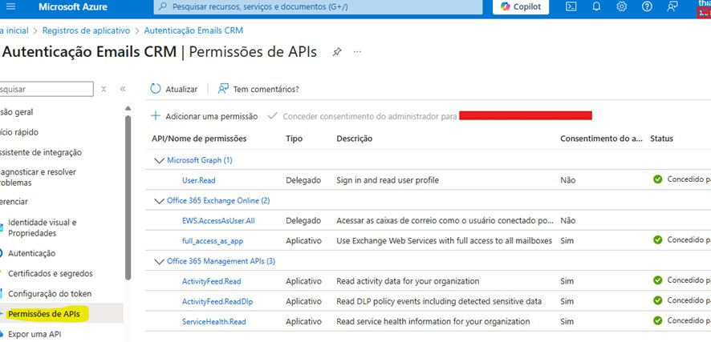

# 🔹 Criação de App Registration no Azure AD para Dynamics 365 Customer Service

Hoje quero compartilhar algo que aprendi recentemente e coloquei em prática: **Criação de App Registration no Azure AD** para integração com o Dynamics 365 Customer Service.

Estou participando de atividades de segregação do parque Dynamics 365 — temos, por exemplo, o **Parque 1** e o **Parque 2** — e, em específico, estava ajustando a atualização de **perfis de servidor de e-mail** para o Dynamics 365 Customer Service.

O objetivo foi adequar a conexão ao **Exchange Online** utilizando a **autenticação moderna (OAuth 2.0)**, já que a autenticação básica ainda funciona, mas está descontinuada pela Microsoft.

---

## 🛠 Passo a passo realizado

1. **Registrar a aplicação no Azure AD**  
   - Criar uma nova App Registration no portal do Azure.

2. **Configurar o Redirect URI e gerar o Client Secret**  
   - No registro da aplicação, configurar o Redirect URI conforme necessário para Dynamics 365.  
   - Gerar um **Client Secret**.

3. **Salvar o valor do Client Secret**  
   - Exemplo: `XYZ001`  
   - Este valor funciona como a “senha” usada na configuração do **perfil de servidor** no Customer Service.

4. **Solicitar ao time de segurança a criação de um grupo de segurança**  
   - Permitir que apenas remetentes do domínio `@empresa.com` enviem e-mails que geram ocorrências no Dynamics 365 Customer Service.

---

## ✅ Resultado

- Maior **controle e segurança** no envio de e-mails.  
- Seguindo as **práticas recomendadas pela Microsoft**.  
- Conexão com o **Exchange Online** utilizando **OAuth 2.0**, garantindo compatibilidade futura e conformidade com autenticação moderna.

---

## 💡 Dicas adicionais

- Sempre **salvar o Client Secret** em local seguro, pois ele não pode ser recuperado depois de criado.  
- Testar a conexão no Dynamics 365 Customer Service após a configuração para garantir que os e-mails estão sendo processados corretamente.  
- Revisar periodicamente o grupo de segurança para manter a segurança e controle do fluxo de e-mails.

### Ocorrências Primárias

