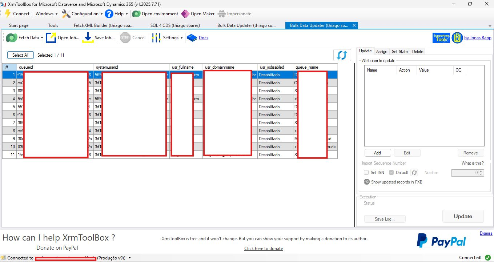

# 🧹 Identificando Usuários Desativados em Filas no Dynamics 365 Customer Service

Recentemente realizei uma tarefa interessante e, claro, precisava compartilhar no LinkedIn 😄.  
No **Dynamics 365 Customer Service**, percebi que havia muitos **usuários desativados** associados a filas. Para manter o sistema organizado, é importante fazer a **grande limpeza**!

Neste post, vou mostrar a forma prática de identificar esses usuários usando **FetchXML no XrmToolBox**.

---

## 🔹 Passo 1: Preparar o FetchXML

Use o seguinte FetchXML para identificar usuários desativados e as filas em que ainda estão associados:

```xml
<fetch>
  <entity name="queuemembership">
    <attribute name="queuemembershipid" />
    <attribute name="queueid" />
    <attribute name="systemuserid" />

    <link-entity name="systemuser" from="systemuserid" to="systemuserid" alias="usr">
      <attribute name="fullname" alias="usr_fullname"/>
      <attribute name="domainname" alias="usr_domainname"/>
      <attribute name="isdisabled" alias="usr_isdisabled"/>
      <filter>
        <condition attribute="isdisabled" operator="eq" value="1" />
      </filter>
    </link-entity>

    <link-entity name="queue" from="queueid" to="queueid" alias="q">
      <attribute name="name" alias="queue_name"/>
    </link-entity>
  </entity>
</fetch>
```

## ✅ Passo 2: O que essa Fetch retorna

- **Usuários desativados** (`isdisabled = 1`)  
- **Filas** em que eles ainda estão associados  
- **Nome completo**, **login** do usuário e o **GUID** (`systemuserid`)

---

## 🔹 Passo 3: Executar no XrmToolBox

1. Abra o **XrmToolBox**.  
2. Abra o **FetchXML Builder**.  
3. Cole o FetchXML na janela de consulta.  
4. Clique em **Execute** ou **Run** para listar os registros.  
5. Verifique se os registros retornados estão corretos e exporte os dados para excel, se possível encaminhe no botão SEND para Data Bulk Updater,por lá você conseguirá visualizar todas as informações tabeladas e realizar o contro C + V numa planilha excel.

## Visual do Relatório



---

## 🔹 Passo 4: Próximos passos

- Vou mostrar como **trabalhar com esses dados** e realizar a **limpeza em massa usando SQL para CDS**.  
- Antes de qualquer exclusão, revise os usuários para evitar impactar operações ativas.  
- Essa abordagem ajuda a manter **organização e governança** dentro do Dynamics 365 Customer Service.


## 💡 Dicas finais

- Sempre faça **testes com poucos registros** antes de executar a limpeza em massa.  
- **Documente o processo** para controle e auditoria.  
- Mantenha as **práticas recomendadas de segurança e governança** do Dynamics 365.
