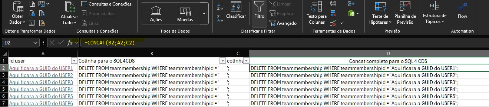

# 🧹 Identificando Usuários Desativados em Filas no Dynamics 365 Customer Service

Recentemente realizei uma tarefa interessante e, claro, precisava compartilhar no LinkedIn 😄.  
No **Dynamics 365 Customer Service**, percebi que havia muitos **usuários desativados** associados a filas. Para manter o sistema organizado, é importante fazer a **grande limpeza**!

Neste post, vou mostrar a forma prática de identificar esses usuários usando **FetchXML no XrmToolBox**.

---

## 🔹 Passo 1: Preparar o FetchXML

Use o seguinte FetchXML para identificar usuários desativados e as filas em que ainda estão associados:

```sql
<fetch>
  <entity name="queuemembership">
    <attribute name="queuemembershipid" />
    <attribute name="queueid" />
    <attribute name="systemuserid" />

    <link-entity name="systemuser" from="systemuserid" to="systemuserid" alias="usr">
      <attribute name="fullname" alias="usr_fullname"/>
      <attribute name="domainname" alias="usr_domainname"/>
      <attribute name="isdisabled" alias="usr_isdisabled"/>
      <filter>
        <condition attribute="isdisabled" operator="eq" value="1" />
      </filter>
    </link-entity>

    <link-entity name="queue" from="queueid" to="queueid" alias="q">
      <attribute name="name" alias="queue_name"/>
    </link-entity>
  </entity>
</fetch>
```

## ✅ Passo 2: O que essa Fetch retorna

- **Usuários desativados** (`isdisabled = 1`)  
- **Filas** em que eles ainda estão associados  
- **Nome completo**, **login** do usuário e o **GUID** (`systemuserid`)

---

## 🔹 Passo 3: Executar no XrmToolBox

1. Abra o **XrmToolBox**.  
2. Abra o **FetchXML Builder**.  
3. Cole o FetchXML na janela de consulta.  
4. Clique em **Execute** ou **Run** para listar os registros.  
5. Verifique se os registros retornados estão corretos e exporte os dados para excel, se possível encaminhe no botão SEND para Data Bulk Updater,por lá você conseguirá visualizar todas as informações tabeladas e realizar o contro C + V numa planilha excel.

## Visual do Relatório


---

# 🧩 Passo 4: Gerando Comandos SQL para Limpeza de Usuários Desativados

Você lembra da **planilha exportada no Bulk Data Updater**, com todos os dados de usuários?  
Então — é nela que vamos trabalhar agora! Nosso objetivo é gerar os **comandos SQL prontos** para exclusão de usuários desativados das tabelas **team membership** e **queue membership** no **SQL 4 CDS**.

---

## 🧠 O que você vai precisar

- Planilha exportada com os **GUIDs dos usuários** (`systemuserid`)  
- Acesso ao **SQL 4 CDS** (no XrmToolBox)  
- Um pouco de **Excel** ou **Google Sheets** para montar as colunas de forma prática  

---

## 📊 Estrutura da planilha

Crie uma nova aba (sheet) com as seguintes colunas:

| Coluna | Conteúdo | Descrição |
|:-------|:----------|:-----------|
| **A** | GUID do usuário (`systemuserid`) | Obtido da FetchXML ou outra consulta |
| **B** | `DELETE FROM teammembership WHERE teammembershipid = '` | Base do comando SQL |
| **C** | `';` | Fechamento do comando |
| **D** | Fórmula para concatenar A + B + C | Gera o comando completo |

---

## 🧮 Exemplo de concatenação

No Excel ou Sheets, use uma fórmula semelhante a esta:

```excel
=B2 & A2 & C2
```
Isso resultará em comandos completos como:

```sql
DELETE FROM teammembership WHERE teammembershipid = 'GUID_DO_USUARIO1';
```

E também para a tabela de filas:

```sql
DELETE FROM queuemembership WHERE queuemembershipid = 'GUID_DO_USUARIO1';
```

## Visual da planilha



