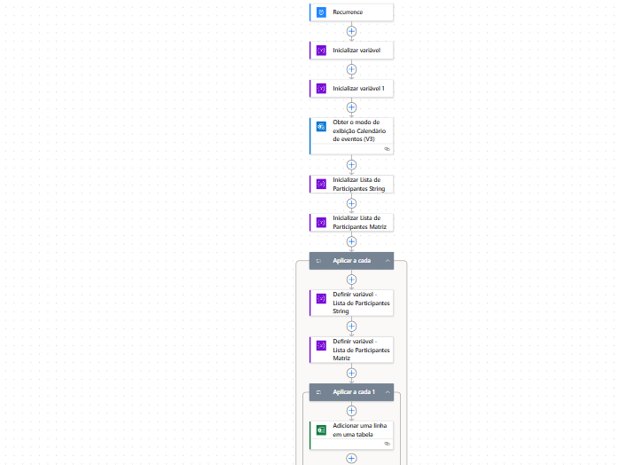

# 📅 Fluxo Power Automate: Exportar reuniões diárias do Outlook para Excel
 
Este guia ensina passo a passo como criar um fluxo no Power Automate que coleta todas as reuniões do dia e registra no Excel, incluindo lista de participantes.

 
## 1️⃣ Criar fluxo automatizado com gatilho de Recurrence
 
1. Abra o Power Automate.
2. Clique em **Criar**.
3. Escolha **Fluxo agendado (Recurrence)**.
4. Configure:
   - Intervalo: **1**
   - Frequência: **Dia**
   - Fuso Horário: **(UTC-03:00) Brasília**
   - Executar em: **18:00**
 
 
Clique em **Criar**.
 
---
 
## 2️⃣ Inicializar Variáveis
 
### 🟢 Variável: InicioJanela
- Ação: **Inicializar variável**
- Nome: **InicioJanela**
- Tipo: **Cadeia de caracteres**
- Valor:
  ```
  @{formatDateTime(addHours(startOfDay(utcNow()), 6), 'yyyy-MM-ddTHH:mm:ssZ')}
  ```

 
### 🔵 Variável: FimJanela
- Ação: **Inicializar variável**
- Nome: **FimJanela**
- Tipo: **Cadeia de caracteres**
- Valor:
  ```
  @{formatDateTime(addHours(startOfDay(utcNow()), 22), 'yyyy-MM-ddTHH:mm:ssZ')}
  ```

 
---
 
## 3️⃣ Obter eventos do Outlook
 
Ação: **Obter o modo de exibição Calendário de eventos (V3)**
 
- **ID do calendário:** normalmente use "Calendar".
- **Hora de Início:** `@{variables('InicioJanela')}`
- **Hora de Término:** `@{variables('FimJanela')}`

 
---
 
## 4️⃣ Inicializar variáveis de participantes
 
### 🟡 ListaParticipantesString
- Nome: **ListaParticipantesString**
- Tipo: **Cadeia de caracteres**
- Valor: *(deixe em branco)*
 
### 🟠 ListaParticipantes (Matriz)
- Nome: **ListaParticipantes**
- Tipo: **Matriz**
- Valor: *(deixe em branco)*
 

 
---
 
## 5️⃣ Aplicar a cada – percorrer eventos
 
Ação: **Aplicar a cada**
 
Selecione a saída:
```
@{outputs('Obter_o_modo_de_exibição_Calendário_de_eventos_(V3)')?['body/value']}
```
 
Dentro dele, adicione:
 
### 5.1) Definir variável – ListaParticipantesString
- Valor: `@{concat(items('Aplicar_a_cada')?['requiredAttendees'], items('Aplicar_a_cada')?['optionalAttendees'])}`
 
### 5.2) Definir variável – ListaParticipantes (Matriz)
- Valor: `@{split(variables('ListaParticipantesString'), ';')}`
 
 
---
 
## 6️⃣ Aplicar a cada 2 – percorrer lista de participantes
 
Ação: **Aplicar a cada 1**
 
Entrada: `@{variables('ListaParticipantes')}`
 
### Ação: Adicionar uma linha em uma tabela – Excel
- Localização: **OneDrive for Business**
- Biblioteca de Documentos: **Documentos**
- Arquivo: selecione *arquivoexcel.xlsx*
- Tabela: **Tabela1**
 
Campos:
- Assunto: `@{items('Aplicar_a_cada')?['subject']}`
- Início: `@{formatDateTime(convertTimeZone(items('Aplicar_a_cada')?['Start'],'UTC','E. South America Standard Time'),'yyyy/MM/dd HH:mm:ss')}`
- Término: `@{formatDateTime(convertTimeZone(items('Aplicar_a_cada')?['end'],'UTC','E. South America Standard Time'),'yyyy/MM/dd HH:mm:ss')}`
- Participantes: `@{items('Aplicar_a_cada_1')}`
 
 
---
 
## 7️⃣ Salvar o fluxo
 
Clique em **Salvar** e dê o nome que desejar.
 
Este fluxo executa diariamente às 18h, varre todas as reuniões do dia e registra no Excel assunto, horário e participantes 📊 — perfeito para projetos que exigem controle de horas ou análise de agendas.
 

 
###Autor

Thiago Souza

Power Platform | Dynamics 365 | Automação de Processos


