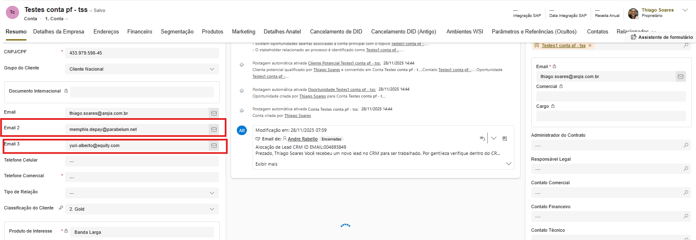
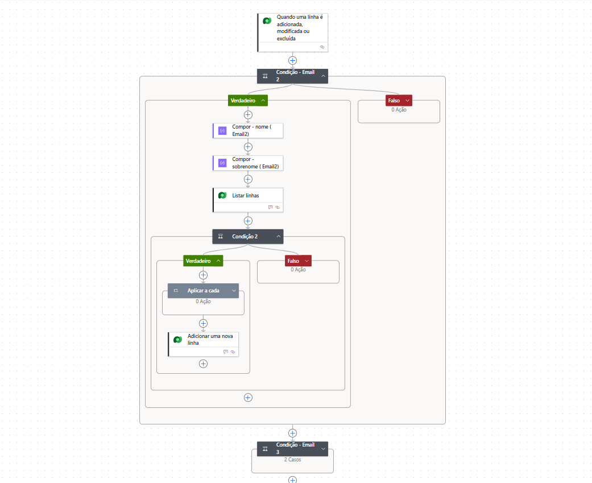
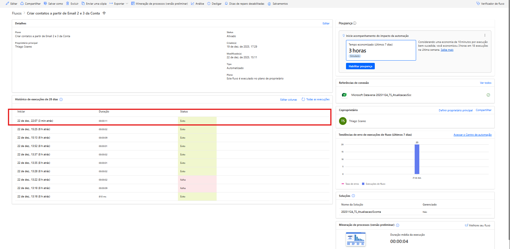
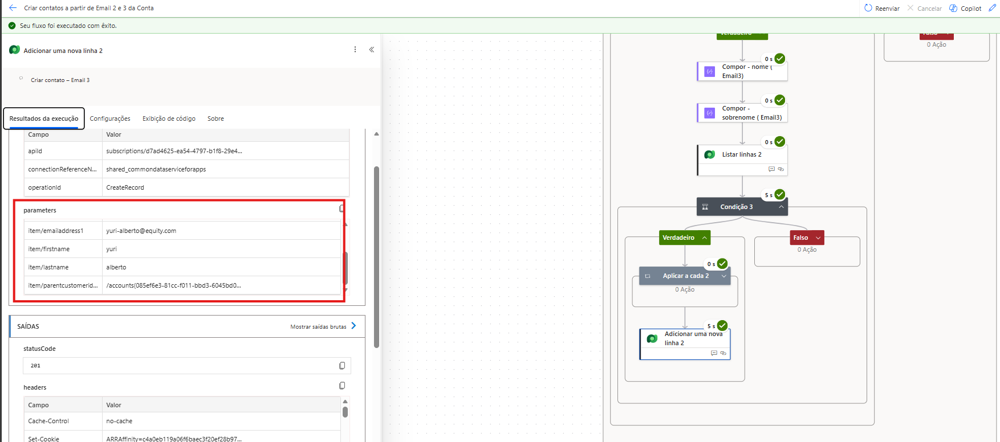
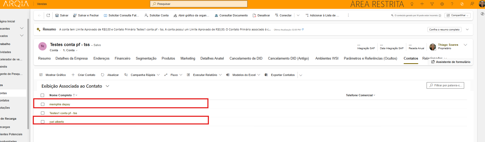
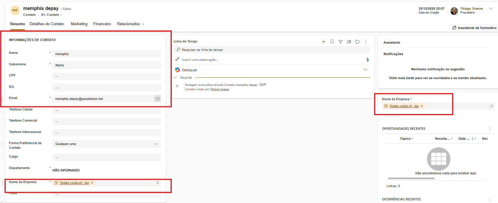

# Automação de Criação de Contatos a partir dos campos Email 2 e Email 3

## Visão Geral

Este projeto demonstra uma automação no Microsoft Dynamics 365 / Dataverse utilizando Power Automate para criação automática de Contatos a partir dos campos Email Address 2 e Email Address 3 da entidade Conta (Account).

A solução foi pensada para cenários reais de negócio, evitando duplicidade de contatos, respeitando relacionamentos com a conta e garantindo compatibilidade com integrações externas e uso pelo time de Marketing.

---

## 🎯 Objetivo da Solução

- Criar contatos automaticamente quando os campos Email 2 ou Email 3 da Conta forem preenchidos  
- Evitar criação de contatos duplicados dentro da mesma conta  
- Tratar diferentes padrões de e-mail (com ponto, hífen ou sem separador)  
- Garantir preenchimento de campos obrigatórios no Dataverse  
- Atender cenários de integração sistêmica e uso operacional por times de marketing

---

## Cenários de Uso

### 1. Integrações externas (ERP, Portais, APIs)

Quando uma integração cria ou atualiza contas no Dynamics 365 Customer Service e popula os campos Email 2 / Email 3, o fluxo:

- Detecta a alteração automaticamente  
- Cria contatos relacionados à conta  
- Evita duplicidade caso o contato já exista para aquela conta  


---

### 2. Time de Marketing / Comercial

- Usuários podem informar múltiplos e-mails na Conta  
- Cada e-mail gera automaticamente um contato  
- Os contatos podem ser usados em:
  - Jornadas de marketing  
  - Disparo de e-mails  
  - Campanhas  
  - Segmentações  




---

## Pré-requisitos

# Microsoft Dynamics 365 / Dataverse  
- Entidades:
  - Account (Conta)  
  - Contact (Contato)  
# Campos existentes na Conta:
  - emailaddress2  
  - emailaddress3  
# Campo obrigatório no Contato:
  - parentcustomerid (Nome da Empresa)  
- Power Automate (Cloud Flow)  

---

## Arquitetura do Fluxo

### Trigger

- Dataverse – Quando uma linha é adicionada ou modificada  
- Tabela: Account  
- Colunas monitoradas: emailaddress2, emailaddress3  


---

## Lógica do Fluxo (Resumo)


### Email Address 2

1. Verifica se o campo Email 2 está preenchido  
2. Lista contatos onde:
   - emailaddress1 = Email 2  
   - parentcustomerid = Conta atual  
3. Se nenhum contato for encontrado:
   - Cria um novo contato relacionado à conta  

### Email Address 3

Repete exatamente a mesma lógica aplicada ao Email 2.




---

## Tratamento Inteligente de Nome e Sobrenome

A automação extrai nome e sobrenome a partir do e-mail, respeitando diferentes padrões.

### Exemplos

| Email                   | Nome         | Sobrenome |
|------------------------|--------------|-----------|
| memphis.depay@parabelum | Memphis      | Depay    |
| yuri-alberto@equity.com | Yuri         | Alberto    |
| breno_bidon@yahoo.com  | Breno         | Bidon   |
| thiagosoares@gmail.com  | thiagosoares | Contato   |

Nota: para casos específicos na qual o e-mail não possua caracteres especiais, como: " . ", " - ", " _ ", de fato, a expressão não identificará qual é o nome e sobrenome. Nesse caso, será considerando nome e sobrenome no campo "nome" e chumbar de forma definitiva no campo: "sobrenome" a nomemclatura: "Contato".

### Expressão – Nome (Firstname)

```
if(
  contains(split(triggerOutputs()?['body/emailaddress2'],'@')[0],'.'),
  first(split(split(triggerOutputs()?['body/emailaddress2'],'@')[0],'.')),
  if(
    contains(split(triggerOutputs()?['body/emailaddress2'],'@')[0],'-'),
    first(split(split(triggerOutputs()?['body/emailaddress2'],'@')[0],'-')),
    if(
      contains(split(triggerOutputs()?['body/emailaddress2'],'@')[0],'_'),
      first(split(split(triggerOutputs()?['body/emailaddress2'],'@')[0],'_')),
      split(triggerOutputs()?['body/emailaddress2'],'@')[0]
    )
  )
)
```

### Expressão – Sobrenome (Lastname)

```
if(
  contains(split(triggerOutputs()?['body/emailaddress2'],'@')[0],'.'),
  last(split(split(triggerOutputs()?['body/emailaddress2'],'@')[0],'.')),
  if(
    contains(split(triggerOutputs()?['body/emailaddress2'],'@')[0],'-'),
    last(split(split(triggerOutputs()?['body/emailaddress2'],'@')[0],'-')),
    if(
      contains(split(triggerOutputs()?['body/emailaddress2'],'@')[0],'_'),
      last(split(split(triggerOutputs()?['body/emailaddress2'],'@')[0],'_')),
      split(triggerOutputs()?['body/emailaddress2'],'@')[0]
    )
  )
)

```


## 📌 Observação:
Para Email 3, basta substituir emailaddress2 por emailaddress3, na estrutura do fluxo para campo Email 3. 


### 🔗 Uso dos Composes na Criação do Contato

Na ação Adicionar uma nova linha (Dataverse – Contato):

First Name
→ Conteúdo dinâmico do Compose – Nome

Last Name
→ Conteúdo dinâmico do Compose – Sobrenome

Email Address 1
→ Valor do Email 2 ou Email 3 da Conta

Nome da Empresa (parentcustomerid)
→ triggerOutputs()?['body/accountid']

Dessa forma:

A - O contato é corretamente relacionado à conta



B - Os campos obrigatórios são preenchidos


C - A lógica fica centralizada e reutilizável

### É possível estender o fluxo para capturar dados adicionais da própria entidade Conta e espelhá-los em campos correspondentes do Contato. Além disso, o fluxo pode ser inicializado a partir de outros cenários, como a importação de dados via planilhas, onde exista a coluna de e-mail acompanhada da razão social, CNPJ ou até mesmo um código específico e único que referencie o cliente, permitindo a identificação da conta correta e a obtenção do accountid.

## Boas Práticas Aplicadas:

1 -Uso de Compose para facilitar manutenção

2 - Prevenção de duplicidade por conta

3 - Fallback para sobrenome

4 - Execução condicionada

5 - Estrutura preparada para escala

### 🔐 Prevenção de Duplicidade

A verificação é feita por Conta, não globalmente

Um mesmo e-mail pode existir em contas diferentes

Para a mesma conta, o contato não será duplicado

### 🧪 Testes Realizados

Criação de conta com Email 2 preenchido

Criação de conta com Email 3 preenchido

Atualização posterior da conta com novo e-mail

Execução múltipla sem duplicidade

Validação de campos obrigatórios

### 📈 Benefícios para o Negócio

Redução de retrabalho manual

Padronização de dados

Melhor qualidade de base para marketing

Escalabilidade para integrações


###Autor

Thiago Souza

Power Platform | Dynamics 365 | Automação de Processos


