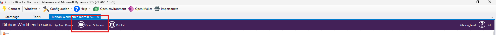
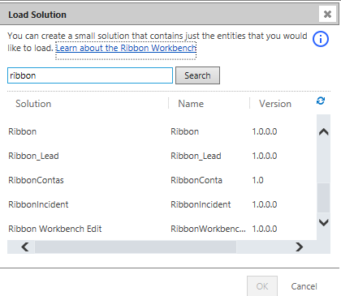
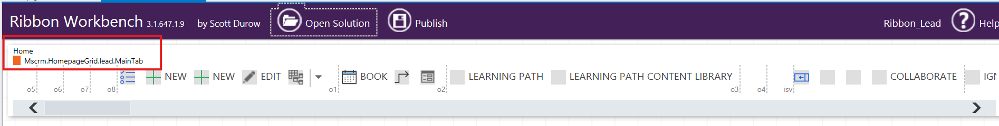
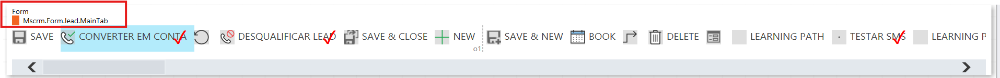
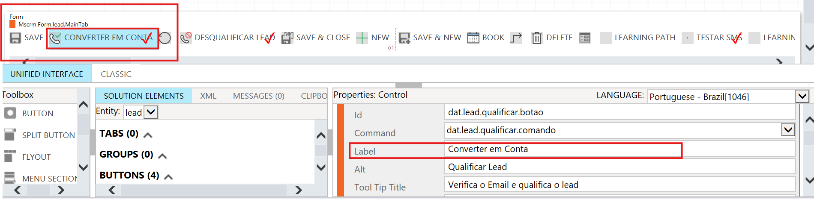

# Ajuste de Ribbon no Dynamics 365 (Ribbon Workbench)

## Objetivo

Documentar o processo de ajuste de botões na Ribbon do Dynamics 365 utilizando o plugin **Ribbon Workbench** (XrmToolBox), explicando a estrutura da Ribbon, boas práticas, limitações da plataforma e o ajuste realizado na nomenclatura e posicionamento do botão **Qualificar Lead**.

---

## Ferramentas Utilizadas

* Power Apps
* XrmToolBox
* Plugin: Ribbon Workbench

---

## Seleção da Solution

Para realizar qualquer ajuste na Ribbon, é necessário selecionar no **Ribbon Workbench** a mesma **Solution** utilizada no Power Apps, correspondente à entidade que será alterada.

Exemplos de solutions:

* `ribbon_lead`
* `ribbon_contas`
* `ribbon_incident`
obs: Cada solution representa a Ribbon de uma entidade específica.
Antes de qualquer alteração, sempre valide se a entidade correta foi selecionada para evitar impactos em outras áreas do sistema.
  ´

## Estrutura da Ribbon

Ao abrir a Ribbon no Ribbon Workbench, são exibidas três linhas principais:

### Home

* Exibida na tela de **listagem de registros (views)**
* Exemplo: lista de Leads, lista de Contas
* Utilizada para ações em massa ou ações antes da abertura de um registro

### Subgrid

* Exibida dentro de formulários, nos **subgrids (listas relacionadas)**
* Exemplo: subgrid de Contatos dentro de uma Conta
* Os botões atuam apenas sobre os registros exibidos naquele subgrid

### Form

* Exibida quando um **registro está aberto**
* Utilizada para ações diretas sobre o registro
* Exemplo: Qualificar Lead, Desqualificar Lead, Salvar, Fechar

> Normalmente, os ajustes são realizados na Ribbon **Form**, pois ela concentra os principais botões de negócio utilizados pelos usuários.

---

## Ajuste Realizado

Após selecionar a solution correta e a Ribbon do tipo **Form**, os botões foram reposicionados conforme solicitado, respeitando a estrutura padrão do Dynamics.

Foi realizada a alteração da **Label (rótulo exibido ao usuário)** do botão padrão:

* **Qualificar Lead** → **Converter em Conta**

### Importante

* Apenas a **Label** foi alterada
* O **nome lógico** do botão não foi modificado
* A **lógica padrão** do sistema foi mantida

Ao clicar no botão **Converter em Conta**, o Dynamics executa exatamente o mesmo comportamento do botão padrão **Qualificar Lead**, sem impacto em regras de negócio, fluxos ou automações existentes.

---

## Comportamento de Duplicidade de Botões na Ribbon Form

Ao reposicionar um botão padrão na Ribbon utilizando o Ribbon Workbench, o botão pode aparecer **duplicado visualmente** na interface do Dynamics, mesmo não aparentando duplicidade no Ribbon Workbench.

Esse comportamento ocorre porque:

* O botão permanece vinculado ao grupo original
* O mesmo botão passa a ser renderizado também no novo grupo onde foi posicionado
* Trata-se do **mesmo botão**, com o mesmo comando e a mesma lógica interna

### Abordagem correta

Para resolver esse comportamento, a prática correta é **ocultar a instância duplicada** do botão no grupo original da Ribbon Form, mantendo apenas a renderização desejada. Para isso, você deve clicar no botão no final da linha do Form, e clicar com lado esquedo do mouse e selecionar "Hiden". Com isso, ficará com uma tarja na diagonal em vermelho no botão e publicar a solution novamente. 

Nenhum botão padrão foi removido do sistema, apenas ocultado visualmente.

Essa abordagem garante:

* Preservação do botão padrão
* Manutenção da lógica nativa do Dynamics
* Compatibilidade com futuras atualizações
* Eliminação da duplicidade visual

---

## Boas Práticas Aplicadas

* Não remover botões padrão
* Não alterar nome lógico ou comando
* Priorizar ajustes visuais (Label e posicionamento)
* Ocultar botões duplicados em vez de removê-los
* Sempre validar a Ribbon **Form** após alterações

Após publicar a solution:

* Limpar cache do navegador (Ctrl + F5)
* Testar em registro novo e existente
* Validar em aba anônima

---

## Limitações Técnicas Importantes

* O cabeçalho do formulário possui limitações nativas
* Campos exibidos no cabeçalho tornam-se somente leitura
* Botões de Qualificar e Desqualificar Lead não são suportados nativamente no cabeçalho de forma editável
* A área recomendada para essas ações é a **Ribbon (barra superior)**

---

## Conclusão

Manter os botões padrão no local correto da Ribbon e realizar apenas ajustes de nomenclatura via **Label** e posicionamento visual é a abordagem mais segura e recomendada.

Essa prática garante estabilidade do ambiente, preserva o fluxo de negócio padrão do Dynamics e reduz riscos em futuras atualizações da Microsoft.

###Autor

Thiago Souza

Power Platform | Dynamics 365 | Automação de Processos
